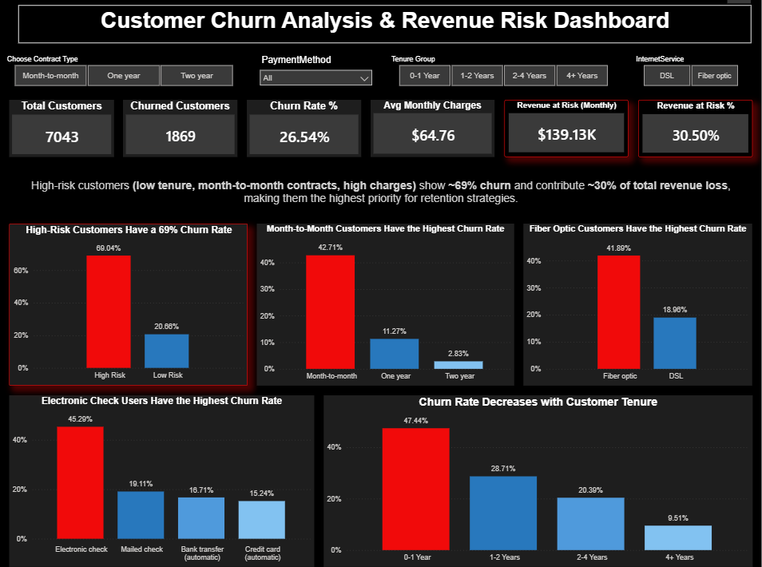

# 📊 Customer Churn Prediction

## 🔍 Problem Statement

Customer churn is a critical business problem impacting revenue and growth.
This project focuses on identifying high-risk customers and uncovering key drivers of churn to enable proactive retention strategies.

---

## 🎯 Objective

* Predict customer churn using machine learning
* Identify high-risk customer segments
* Quantify potential revenue at risk
* Provide actionable retention strategies

---

## 📁 Dataset

* **Source:** Telco Customer Dataset
* **Records:** ~7,043 customers
* **Features:** Demographics, account details, services, billing

**Location:**  
- `data/customer_churn_dataset.csv`

**Data Quality:**
- No missing values  
- Clean categorical encoding  
- Consistent schema ready for analysis

---

## ⚙️ Approach

### 1. Data Validation & Cleaning

* Checked for missing values (**no significant nulls found**)
* Validated categorical consistency (**no unexpected labels**)
* Verified numerical distributions and potential outliers
* Encoded categorical variables for modeling

---

### 2. Exploratory Data Analysis (SQL)

Performed EDA using SQL to analyze churn patterns across:

* Contract types
* Tenure groups
* Monthly charges

**Key Findings:**

* Customers with **month-to-month contracts** have significantly higher churn
* **Low tenure + high monthly charges** segment shows the highest churn risk
* Lack of **value-added services (Tech Support, Online Security)** increases churn probability

---

### 3. Feature Engineering (Python)

* Created tenure-based segments (low / medium / high)
* Grouped contract types
* Derived risk-oriented features for modeling

---

### 4. Predictive Modeling (Python)

**Models implemented:**

* Logistic Regression (baseline, class-balanced, threshold-tuned)
* Random Forest
* XGBoost

**Evaluation metrics:**

* Accuracy
* Precision / Recall
* ROC-AUC

**Final Model Selection:** Logistic Regression with threshold = **0.25**

**Model Performance:**

* ROC-AUC: ~0.84
* Recall (Churn class): **~0.81**
* Precision: **~0.50**
* Accuracy: **~0.73**

---

### 5. Threshold Optimization

* Tuned classification threshold to balance precision and recall
* Lowered threshold to **0.25** to prioritize churn detection
* Recall improved significantly (~0.57 → ~0.81), enabling better identification of at-risk customers
* Precision decreased (~0.66 → ~0.50), increasing false positives
* Accuracy reduced (~81% → ~73%), reflecting the trade-off

👉 Focus shifted from accuracy to **maximizing recall**, aligning with business objectives

---

### 6. Dashboard & Visualization (Power BI)

* Built an interactive dashboard to visualize:

  * Churn distribution
  * High-risk customer segments
* Enabled filtering by tenure, contract type, and charges

#### 📊 Dashboard Preview



**Key highlights:**

* Churn Rate: **26.54%**
* Revenue at Risk: **$139K (~30%)**
* High-risk customers contribute disproportionately to revenue loss

---

## 📈 Key Insights

* Overall churn rate: **~26%**

**High-risk segment characteristics:**

* Low tenure

* Month-to-month contracts

* High monthly charges

* **~65–70% churn probability**

* Long-term contract customers show significantly lower churn

* High-risk customers contribute **~30% of total revenue at risk (~$139K monthly)**

* Model captures **~81% of churners**, significantly reducing missed revenue-risk customers

---

## 💡 Business Recommendations

* 🎯 Target high-risk customers with retention offers
* 💰 Encourage long-term contracts through pricing incentives
* 📞 Improve onboarding & engagement for low-tenure customers
* 📦 Bundle value-added services to reduce churn probability

---

## 📂 Repository Structure

* `sql/` → SQL-based EDA
* `notebook/` → Python modeling
* `dashboard/` → Power BI dashboard
* `data/` → Dataset
* `outputs/` → Visualizations and figures

---

## 🚀 How to Run

```bash
git clone https://github.com/rk-analytics/customer-churn-prediction.git
cd customer-churn-prediction
pip install -r requirements.txt
jupyter notebook notebook/churn_modeling.ipynb
```

---

## 🛠 Tools & Technologies

* Excel (initial data validation and cleaning)
* Python 3.10+ (pandas, numpy, scikit-learn, xgboost)
* SQL (data querying and EDA)
* Power BI (dashboarding)

---

## 📌 Project Highlights

* End-to-end pipeline (**SQL → Python → BI**)
* Focus on **business impact, not just model accuracy**
* Threshold tuning aligned with real-world decision-making

---

## 👤 Author

**Rahul**
